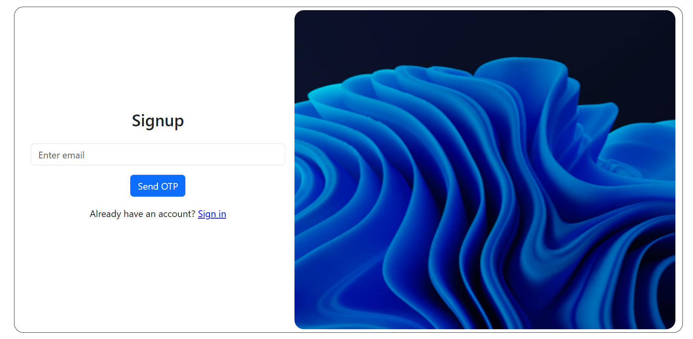
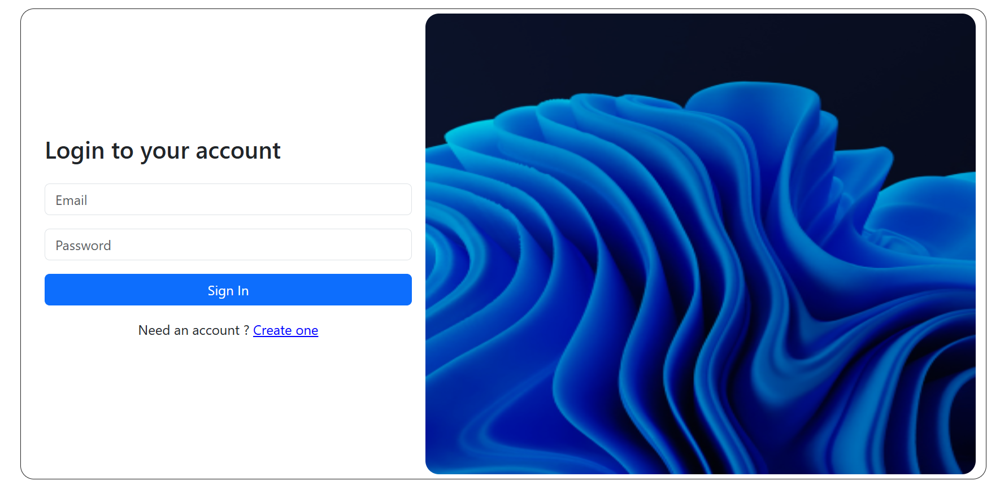
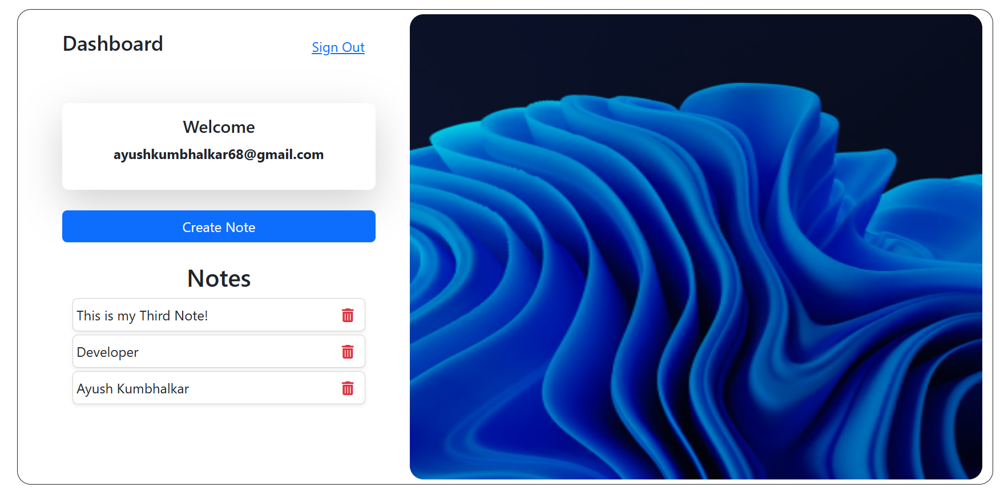

# 📝 NoteKeeper — Simple & Secure Note-Taking App

> A responsive and secure MERN-stack note-taking app built with email + OTP authentication.  
> ✅ **Live Project:** [https://highway-delite-test.netlify.app](https://highway-delite-test.netlify.app)

---

## 📱 Screenshots

### 💻 Desktop View
  

### 📱 Mobile View
  

---

## 🚀 Features

- 🔐 Signup with OTP verification  
- 🔑 JWT-based login authentication  
- 📝 Create, view, and delete notes  
- 📦 Persistent storage with MongoDB  
- 📱 Mobile-friendly responsive design  
- 🌐 Live deployed on **Netlify** (frontend) and **Render** (backend)

---

## 🛠️ Tech Stack

**Frontend**
- React
- Bootstrap 5
- Axios

**Backend**
- Node.js
- Express.js
- MongoDB (Mongoose)
- JWT for authentication
- Nodemailer (for OTPs)

---

## 📂 Folder Structure

NoteKeeper/
│
├── client/        # React frontend
│   └── src/
│       └── components/
│       └── pages/
│       └── App.js
│
├── server/        # Node.js backend
│   └── routes/
│   └── controllers/
│   └── models/
│   └── server.js

---

🔧 Local Development Setup
1. Clone the repo
Copy
Edit
git clone https://github.com/FrontendwithAyush/note-app.git
cd note-app

---

2. Install dependencies
   # Install server dependencies
cd server
npm install

# Install client dependencies
cd ../client
npm install

---

3. Setup Environment Variables
Create .env file inside /server:

env
Copy
Edit
PORT=5000
MONGO_URI=your_mongodb_uri
JWT_SECRET=your_secret
EMAIL_USER=your_email
EMAIL_PASS=your_email_password  

---

4. Run Locally
Copy
Edit
# Start backend
cd server
npm start

# Start frontend
cd ../client
npm start

 ---

 | Method | Endpoint                    | Description          |
| ------ | --------------------------- | -------------------- |
| POST   | `/api/auth/send-otp`        | Send OTP to email    |
| POST   | `/api/auth/verify-otp`      | Verify OTP           |
| POST   | `/api/auth/create-password` | Set account password |
| POST   | `/api/auth/login`           | Login                |
| POST   | `/api/notes/add`            | Add a new note       |
| GET    | `/api/notes/fetch`          | Fetch all user notes |
| DELETE | `/api/notes/delete/:noteId` | Delete a note        |

🔐 All /api/notes/* routes require a valid Bearer token in the header.

---

✨ Deployment
Frontend: Deployed on Netlify

Backend: Deployed on Render

---
🤝 Contribute
PRs are welcome. For major changes, open an issue first to discuss what you would like to change.
